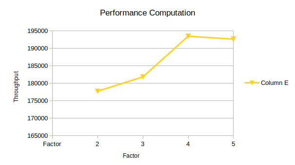

# Multithreaded File Server

A TCP file server in C++ built on a hand-rolled pthread thread pool with a shared job queue, plus a
load generator to measure how throughput responds to pool size.

Course project at IIIT Hyderabad (2020). Team of four — see [Authors](#authors).

## Design

```
client ──TCP──▶ accept loop ──▶ job queue ──▶ ┌─ worker 1 ─┐
                               (mutex +       ├─ worker 2 ─┤──▶ parse request, send file
                                condvars)     └─ worker N ─┘
```

The accept loop never does work itself. It enqueues the connection and returns immediately, so
accepting is decoupled from serving and a slow transfer can't stall new arrivals.

**Synchronisation** is a mutex plus two condition variables:

- `q_NonEmpty` — workers block here when the queue is empty, rather than spinning. Idle threads cost
  nothing.
- `q_Empty` — lets a graceful shutdown wait until outstanding jobs have drained.

## Beyond the base requirement

- **Dynamic pool growth.** Under sustained load the pool scales by a factor of *k*, capped at 50
  threads so a burst can't exhaust the system.
- **Two shutdown modes.** `destroy_threadpool(1)` drains the queue before terminating workers;
  the immediate variant tears down without waiting.

## API

```c
void create_threadpool(int n);
void dispatch(dispatch_fn dispatch_to_here, void *arg);
void parseRequest(clientIdentity clientData);
void destroy_threadpool(int option);   // 1 = drain queue first
```

## Running it

```bash
./automake.sh      # build
./main             # start the server
./reqgen.sh        # fire 50 concurrent GET clients
```

`reqgen.sh` opens 50 terminal tabs each issuing `GET#test`, which is how the timing data behind
`graph_HPC.png` was collected — throughput against thread-pool size.



## Authors

| | |
|---|---|
| Sangam | 2019201013 |
| Divyani Indurkhya | 2019201028 |
| Mudit Malpani | 2019201063 |
| Nisarg | 2019201065 |

## Limitations

- Requests are served from a fixed working directory with no path sanitisation — trivially
  traversable, fine for a controlled assignment, not for anything exposed.
- No connection timeouts; a client that opens a socket and stops reading holds a worker indefinitely.
- The pool grows but never shrinks back down after load subsides.
